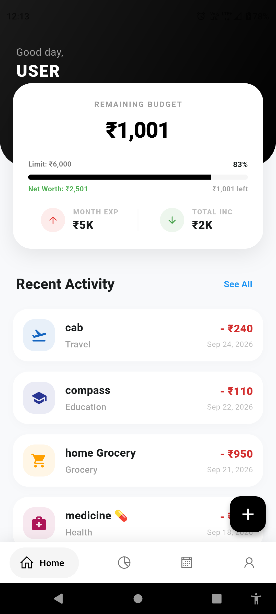
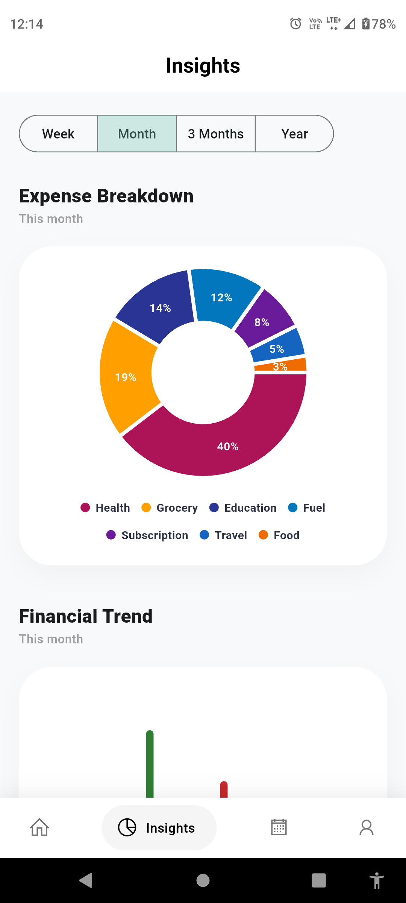
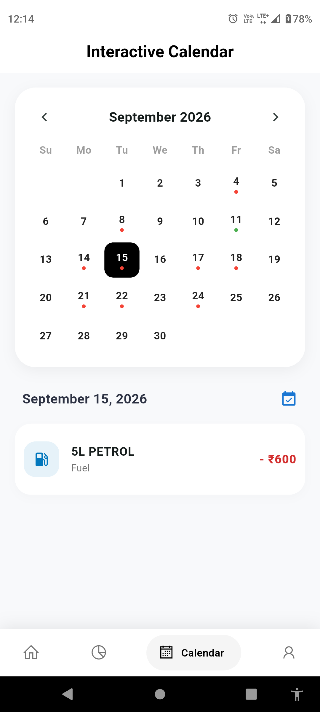
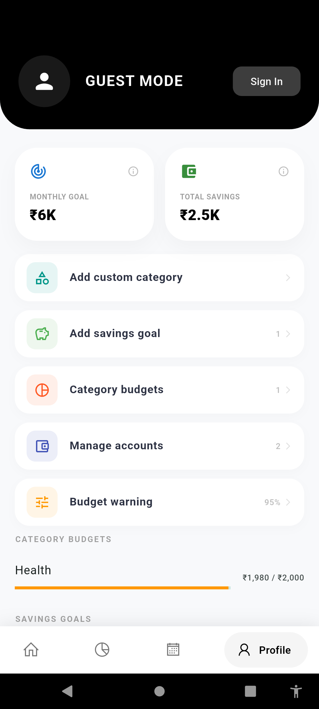
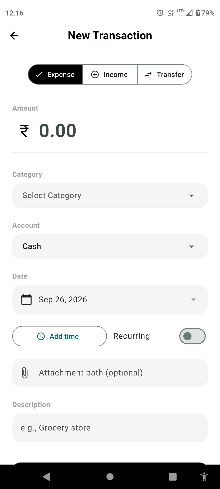
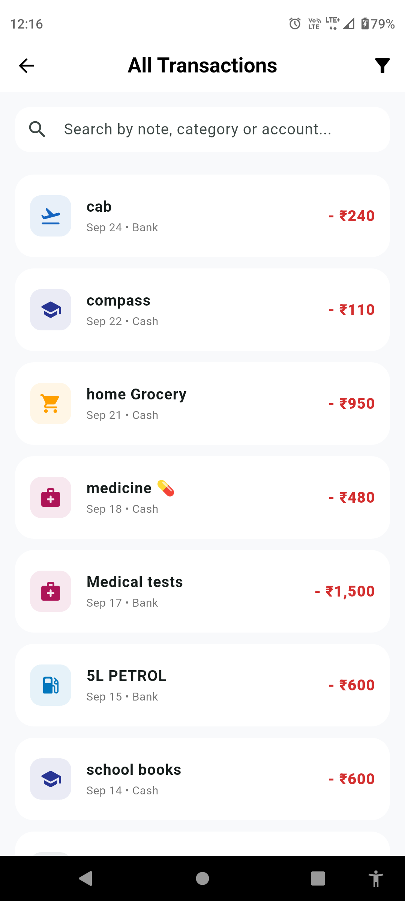
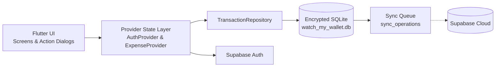

# 👛 Watch My Wallet

> **A privacy-first, offline-ready personal finance dashboard built with Flutter, Supabase, and encrypted local SQLite storage.**

[](https://flutter.dev)
[](https://dart.dev)
[](https://supabase.com)
[](https://www.zetetic.net/sqlcipher/)
[](#)
[](#)

---

### ✨ Key Differentiators

- 🛡️ **Military-Grade Local Encryption**: All sensitive financial records are encrypted on-device via AES-256 `SQLCipher` with hardware-backed key storage.
- ⚡ **Zero-Latency Offline First**: Log transactions immediately—no network spinners, no timeout errors, and 100% functionality without internet.
- 👤 **Instant Frictionless Guest Mode**: Start tracking on day one without mandatory sign-ups, with seamless one-tap data migration to a cloud account whenever you're ready.
- 💳 **Multi-Account & Transfer Engine**: Manage Bank, Cash, and Savings wallets with atomic inter-account transfer calculations and real-time balance resolution.
- 🎯 **Proactive Spending Alerts**: Set category limits and overall monthly budgets with automated threshold warnings before you overspend.
- 🔄 **Cloud-Sync Ready**: Local mutation queue (`sync_operations`) captures all changes offline, prepared for seamless remote sync via Supabase.

---

## 📱 App Screenshots

| 🏠 Home Dashboard | 📊 Insights & Analytics | 📅 Calendar View |
| :---: | :---: | :---: |
|  |  |  |
| **Active balances, monthly goal, recent logs** | **Category breakdown, spending trends, averages** | **Day-by-day cashflow dots & date filtering** |

| 👤 Profile & Accounts | ➕ Add Transaction | 🕒 Transaction History |
| :---: | :---: | :---: |
|  |  |  |
| **Wallet limits, savings goals, security** | **Expense, income, or transfer with quick tags** | **Swipe-to-delete, tap-to-edit & search filters** |

---

## 💡 What Problem Does This Solve?

Most modern personal finance apps come with significant trade-offs:
1. **Mandatory Sign-Up Gates**: You can't track a simple \$4 coffee without entering an email, verifying a code, or linking a bank account.
2. **Offline Fragility**: If you're on a subway, on a flight, or in an area with poor reception, cloud-first apps lock up or fail to record entries.
3. **Data Privacy Concerns**: Your detailed spending habits, income sources, and net worth are stored in plaintext on third-party servers.

**Watch My Wallet** eliminates these frustrations by putting **local-first reliability and user privacy at the center**, pairing the instant responsiveness of a native device database with the optional sync benefits of modern cloud backends.

---

## 🚀 Why Watch My Wallet?

- **True Ownership**: Your financial data lives on your device, encrypted with a 256-bit AES key saved in secure hardware storage (`FlutterSecureStorage`).
- **Smooth, Modern Gestures**: Swipe left to delete with instant **Undo**, tap to view or edit details, and long-press for safe delete confirmation.
- **Unified Transfers**: Moving money from Bank to Cash accurately adjusts both balances simultaneously without double-counting as an expense.
- **Recurring Automation**: Automatically populate subscriptions, bills, and recurring income streams on their scheduled dates.
- **Dark Mode & Material 3**: Beautiful, ergonomic interface designed for quick one-handed entries on the go.

---

## 🛠️ How It Works

```
1. Instant Onboarding ──► Start immediately in Guest Mode (zero login required)
        │
        ▼
2. Multi-Wallet Setup ──► Organize Bank, Cash & Savings balances
        │
        ▼
3. Everyday Tracking  ──► Log expenses, income & transfers in under 3 seconds
        │
        ▼
4. Smart Insights     ──► Monitor monthly budgets, category caps & savings milestones
        │
        ▼
5. Cloud Sync Ready   ──► Sign in with Supabase; local data automatically migrates to your cloud account
```

---

## 📦 Features at a Glance

### 💰 Cashflow & Transaction Management
- Categorized recording for **Expense**, **Income**, and **Account Transfers**.
- Intuitive **Swipe-to-Delete** with floating Undo snackbars.
- **Tap-to-Edit** transaction amounts, notes, and dates.
- Visual date tags and optional recurring transaction scheduling.

### 💳 Wallets & Accounts
- Track multiple accounts (e.g., *Main Bank*, *Cash Wallet*, *Emergency Savings*).
- Dynamic balance resolution: Opening Balance + Total Incomes - Total Expenses + Net Transfers.
- Account archiving and balance verification.

### 🎯 Budgets & Savings Goals
- Overall monthly spending limits with customizable warning thresholds (50% – 100%).
- Individual **Category Budgets** to restrict spending in specific areas like Dining or Shopping.
- Dedicated **Savings Goals** with visual progress bars and milestone funding.

### 🔍 Search, Filter & Calendar
- Full transaction history with instant keyword search across notes, categories, and accounts.
- Filter by transaction type, date range, or category.
- Dynamic **Monthly Calendar** indicating income and expense activity by day.

---

## 🗄️ Database & Schema Overview

Watch My Wallet maintains an optimized relational schema in local encrypted SQLite, mirroring cloud tables designed for Supabase:

| Table | Purpose |
| --- | --- |
| `accounts` | Wallet/account tracking (Cash, Bank, Savings) |
| `categories` | Income/expense/transfer category classification |
| `transactions` | Core financial entries with amounts, dates, notes, and types |
| `budgets` | Monthly spending limits and thresholds |
| `savings_goals` | Long-term target savings goals and milestone tracking |
| `sync_operations` | Local sync queue for offline mutation tracking & future cloud sync |

> 📖 **Looking for deep engineering details?**  
> Check out the [`docs/architecture.md`](docs/architecture.md) for full documentation on encryption key generation, soft-delete semantics, offline journaling, and conflict resolution rules.

---

## 🏗️ Architecture Overview

The application follows a clean layered architecture separating presentation, business logic, local persistence, and cloud synchronization:



---

## 🏁 Getting Started

### Prerequisites

- [Flutter SDK](https://docs.flutter.dev/get-started/install) (`3.12.0` or later)
- Android Studio / VS Code with Flutter & Dart extensions
- Xcode (for iOS builds on macOS)
- A free [Supabase](https://supabase.com) project (for authentication & cloud sync)

### Installation & Run

1. **Clone the repository**:
   ```bash
   git clone https://github.com/your-username/watch_my_wallet.git
   cd watch_my_wallet
   ```

2. **Install dependencies**:
   ```bash
   flutter pub get
   ```

3. **Configure Supabase**:
   Open `lib/main.dart` and provide your Supabase project credentials:
   ```dart
   await Supabase.initialize(
     url: 'https://YOUR_SUPABASE_PROJECT.supabase.co',
     anonKey: 'YOUR_SUPABASE_ANON_KEY',
   );
   ```

4. **Launch the application**:
   ```bash
   flutter run
   ```

---

## 🧪 Testing & Quality Assurance

Run the automated test suite to verify insight metrics and budget calculation logic:

```bash
# Run all tests
flutter test

# Run insight calculation unit tests
flutter test test/insight_metrics_test.dart

# Run static analysis
flutter analyze
```

---

## 🗺️ Roadmap

- [x] Local encrypted persistence with SQLCipher
- [x] Multi-account management and balance resolution
- [x] Instant Guest mode with user data migration upon login
- [x] Swipe-to-delete with undo and tap-to-edit dialogs
- [x] Monthly spending goals and category budgets
- [x] Calendar-based daily cashflow indicators
- [ ] Background synchronization worker for Supabase cloud tables
- [ ] Biometric lock (Fingerprint / Face ID)
- [ ] CSV & PDF expense report export
- [ ] Receipt image attachment storage

---

## 📄 License

This project is licensed under the [MIT License](LICENSE).
