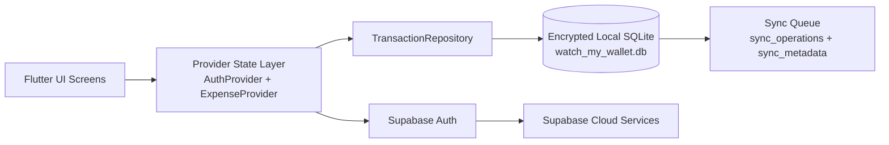

# Watch My Wallet

A privacy-first, offline-ready personal finance dashboard built with Flutter, Supabase, and encrypted local SQLite storage.


## Project overview

Watch My Wallet is a modern budgeting and expense tracking app designed for real-world use: it supports guest access, secure local persistence, recurring transactions, monthly budgets, savings goals, and account or category management. The app is built around an offline-first architecture so users can keep tracking expenses even without a stable internet connection, while also preparing the foundation for account-level cloud sync through Supabase.

This project currently combines:

- Encrypted local persistence with `sqflite_sqlcipher`
- Secure encryption key generation via `flutter_secure_storage`
- Supabase-powered authentication for login and signup
- Provider-based state management and local data aggregation
- Budget, category, savings, transfer, and recurring transaction workflows
- Dark mode and guest mode flows for a smoother onboarding experience

## Why this app exists

Personal finance apps often fail when connectivity drops or when users want a fast, frictionless experience without always depending on the cloud. This project addresses that by prioritizing local-first reliability, while designing the data model and sync bookkeeping to support future cloud synchronization without losing user data.

## Features

- Expense, income, and transfer tracking
- Multiple wallet accounts with opening balances and balance calculations
- Custom categories for income, expense, and transfer flows
- Monthly spending budget and per-category budget tracking
- Savings goals with target amounts and milestone tracking
- Recurring transactions with automatic generation logic
- Transaction history and account-linked financial summaries
- Dark mode support
- Guest mode support for quick offline usage
- Email sign-in / sign-up using Supabase auth
- SQLite-based local persistence with encrypted database access
- Built-in sync metadata tables for future cloud synchronization

## Screenshots

The project currently does not include checked-in product screenshots, so this section is intentionally structured as a gallery placeholder for your app images.

| Dashboard | Add transaction | History |
| --- | --- | --- |
|  |  |  |

Suggested screenshots to capture later:

- Home dashboard with monthly budget card
- Add record flow for income, expense, and transfer
- Transaction history with filtering and category breakdown
- Accounts and savings goals management screen
- Budget warning states and insights view

## Architecture



### Key architectural components

- `lib/main.dart` initializes the app and database, then boots the providers.
- `lib/providers/auth_provider.dart` manages authentication state and guest mode.
- `lib/providers/expense_provider.dart` aggregates account, category, budget, and transaction state.
- `lib/data/local/local_database.dart` creates the encrypted SQLite schema and default seed data.
- `lib/data/repositories/transaction_repository.dart` centralizes insert, update, delete, and budget logic.
- `lib/data/models/local_entities.dart` defines the entity model for accounts, categories, budgets, and transactions.
- `lib/pages/*` contains the screens for login, home, account management, and transaction history.

## Database design

The app uses a local relational schema with SQLite and SQLCipher encryption. Core entities include:

| Table | Purpose |
| --- | --- |
| `accounts` | Store bank, cash, and savings accounts |
| `categories` | Expense, income, and transfer categories |
| `transactions` | Core financial entries with amounts, dates, notes, and types |
| `budgets` | Monthly budget target by user |
| `category_budgets` | Budget target per category |
| `recurring_transactions` | Recurring transaction metadata and next occurrence |
| `savings_goals` | Long-term saving targets |
| `app_settings` | Theme and user preferences |
| `sync_operations` | Pending cloud sync operations log |
| `sync_metadata` | Metadata used to track synchronization state |

### Important data model concepts

- `LocalTransactionType` supports `income`, `expense`, and `transfer`.
- `SyncStatus` supports `synced`, `pendingCreate`, `pendingUpdate`, `pendingDelete`, and `failed`.
- Every important mutation is marked with a timestamp and a sync status to support future synchronization.
- The transaction schema includes `deleted_at` for soft-delete semantics instead of hard deletes.

## Local database setup

The local database is created in `lib/data/local/local_database.dart` and opened with SQLCipher encryption.

### How encryption works

- `SecurityManager.getDatabaseKey()` generates a secure random 32-byte key.
- That key is saved in `FlutterSecureStorage` so it survives app restarts.
- `LocalDatabase.open()` opens the database with `password: key`.

### Default database behavior

On first run:

1. The database is created at the app data directory.
2. Foreign key enforcement is enabled.
3. Core tables are created.
4. Default accounts and default categories are seeded.
5. An initial sync metadata state is initialized.

The current schema version is `3`, and migration logic rebuilds the schema when updates require it.

## Cloud setup

This project uses Supabase for authentication and cloud-ready data integration.

### Required configuration

Update the Supabase configuration in `lib/main.dart`:

```dart
await Supabase.initialize(
  url: 'YOUR_SUPABASE_URL',
  publishableKey: 'YOUR_SUPABASE_ANON_KEY',
);
```

### Recommended Supabase setup

- Enable Email Auth in the Supabase dashboard.
- Configure your project URL and anon key in the app.
- Add row-level security policies for user-scoped tables.
- Optionally create `profiles`, `transactions`, or a sync queue table for future multi-device sync.

The app also contains a legacy `records` table reference in `lib/record_database.dart`, which indicates an earlier cloud-backed concept that is not the main current runtime flow.

## Sync strategy

The project is intentionally built with an offline-first sync model:

1. User actions are written locally to the encrypted SQLite database first.
2. Mutations update `sync_status` to `pendingCreate`, `pendingUpdate`, or `pendingDelete`.
3. Every operation is written to `sync_operations` with the entity type, payload, operation, and timestamp.
4. The sync layer can later replay those pending journal entries to Supabase or a server-backed store.
5. The app remains usable without an active internet connection.

This means the app is not just a networked app—it behaves as a resilient personal finance tool that can sync when connectivity returns.

## Conflict resolution strategy

The current repository contains the foundations for a simple and predictable conflict strategy:

- Use `updated_at` as the canonical timestamp for comparing versions.
- Favor the most recent write when a record is edited on two devices.
- Preserve a soft-delete (`deleted_at`) as a higher-priority state when a record is deleted remotely or locally.
- Keep `sync_status` so failed actions can be retried without losing data.

In practical terms, the intended rule is:

- latest `updated_at` wins
- if a delete and an update race, the delete wins if it is newer
- failed syncs remain queued and retried rather than dropped

This is the correct pattern for a finance app because it reduces accidental data loss and keeps auditability intact.

## Installation instructions

### Prerequisites

- Flutter SDK (3.12.x or later)
- Android Studio or VS Code with Flutter extensions
- Xcode for iOS development if you are testing on Apple hardware
- A Supabase project with Auth enabled

### Setup steps

1. Clone the repository:

```bash
git clone <your-repo-url>
cd watch_my_wallet
```

2. Install dependencies:

```bash
flutter pub get
```

3. Configure Supabase in `lib/main.dart` with your project URL and anon key.

4. Run the app:

```bash
flutter run
```

### Optional: initialize Android/iOS builds

```bash
flutter clean
flutter pub get
flutter run
```

## Testing instructions

This project includes a focused test suite covering budgeting and insight calculations.

### Run all tests

```bash
flutter test
```

### Run the current insight-focused suite

```bash
flutter test test/insight_metrics_test.dart
```

### Suggested manual QA checklist

- Create an expense, income, and transfer entry
- Verify account balances update correctly
- Confirm the budget warning threshold reacts appropriately
- Test recurring transaction generation
- Test guest mode and sign-in flow
- Verify dark mode toggle persists correctly

## Known limitations

This project is a strong local-first MVP, but there are still limitations to be aware of:

- Cloud sync is partially designed but not yet fully operational as a background worker.
- The runtime currently relies on Supabase auth, while the full financial record sync pipeline is still being finalized.
- The codebase still contains legacy cloud-oriented references (`RecordDatabase`, `records` table) that should be cleaned up or replaced.
- The database schema and sync logic are local-first but not yet fully hardened for large-scale multi-device production use.
- Some screens and flows are focused on functionality and UX rather than a fully packaged production design system.
- There is no current export/import system for data backups.
- There is no dedicated background service for automatic sync retries beyond the queued transactional model.

## Recommended next steps

- Implement a real sync worker that reads `sync_operations` and pushes changes to Supabase.
- Add a proper cloud schema for transactions, accounts, categories, and budgets.
- Add unit tests around repository logic, conflict handling, and migration behavior.
- Add screenshots and a polished onboarding flow.
- Add analytics, CSV export, and recurring transaction management improvements.

## Summary

Watch My Wallet is a practical personal finance app focused on trust, reliability, and clean local-first behavior. It already delivers a meaningful budgeting experience while setting up the right data and state architecture for a future full cloud synchronization layer.

If you are building this for a portfolio, prototype, or personal product, it is already structured as a solid foundation for a polished money-management app.
