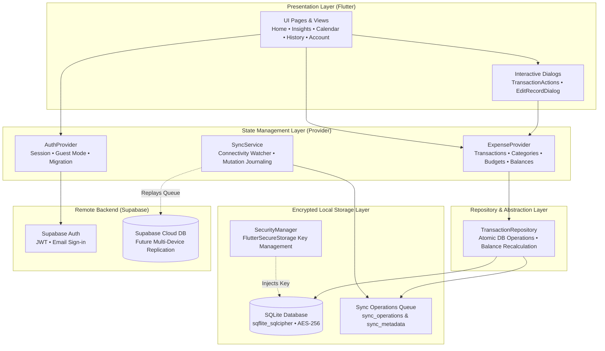

# Watch My Wallet — Technical Architecture & Engineering Deep-Dive

This document details the engineering specifications, local encryption mechanics, synchronization pipeline, and data layer contracts for **Watch My Wallet**.

---

## 1. System Architecture Diagram



---

## 2. Local Database & Security Architecture

### 2.1 SQLCipher Encryption
All local storage is encrypted using **`sqflite_sqlcipher`** (AES-256).

1. **Key Generation**: Upon first app execution, `SecurityManager.getDatabaseKey()` cryptographically generates a random 32-byte encryption key.
2. **Secure Key Persistence**: The key is stored in the device's hardware-backed keystore/keychain via `flutter_secure_storage`.
3. **Database Initialization**: `LocalDatabase.open()` retrieves the encryption key and opens `watch_my_wallet.db` with `password: key`. Unauthenticated or unkeyed file reads are rendered unreadable cipher text.

### 2.2 Schema Lifecycle & Seed Mechanics
- **Foreign Keys**: Enabled by default (`PRAGMA foreign_keys = ON;`).
- **Global Baseline Seeding**: System-wide default accounts (`account_cash`, `account_bank`, `account_savings`) and 19 default categories are seeded with `user_id = NULL` and `sync_status = 'synced'`.
- **User Scoping & Isolation**: Queries automatically fetch user-owned records and fallback to system defaults via `(user_id = ? OR user_id IS NULL) AND deleted_at IS NULL`.
- **Soft Deletion**: Records are marked with `deleted_at` timestamps rather than physically purged, ensuring deletion events can sync across devices without collision.

---

## 3. Data Entities & Schema Overview

| Entity | SQLite Table | Core Attributes |
| --- | --- | --- |
| **Account** | `accounts` | `id`, `user_id`, `name`, `opening_balance`, `created_at`, `updated_at`, `deleted_at`, `sync_status` |
| **Category** | `categories` | `id`, `user_id`, `name`, `type` (income/expense/transfer), `is_default`, `sync_status` |
| **Transaction** | `transactions` | `id`, `user_id`, `account_id`, `to_account_id`, `category_id`, `amount`, `type`, `note`, `transaction_date`, `time`, `attachment_path`, `is_recurring`, `sync_status` |
| **Budget** | `budgets` | `id`, `user_id`, `amount`, `created_at`, `updated_at` |
| **Category Budget** | `category_budgets` | `id`, `user_id`, `category_id`, `amount`, `month_key` |
| **Savings Goal** | `savings_goals` | `id`, `user_id`, `name`, `target_amount`, `current_amount`, `target_date` |
| **Recurring Entry** | `recurring_transactions` | `id`, `transaction_id`, `frequency`, `next_date`, `is_active` |
| **Sync Journal** | `sync_operations` | `id`, `table_name`, `record_id`, `operation`, `payload`, `timestamp`, `status` |
| **Sync Metadata** | `sync_metadata` | `key`, `value`, `updated_at` |

---

## 4. Offline-First Sync & Mutation Journaling

```
[User Action]
     │
     ▼
[Write to Local SQLite] ──► Set sync_status = 'pendingCreate' | 'pendingUpdate' | 'pendingDelete'
     │
     ▼
[Enqueue to sync_operations] ──► Records table_name, operation, JSON payload, and UTC timestamp
     │
     ▼
[Background Sync Worker] ──► When connectivity detected & authenticated, replays entries in order to Supabase
```

### 4.1 Sync States
- `synced`: Record is fully aligned with cloud state.
- `pendingCreate`: Created locally while offline; pending initial cloud insert.
- `pendingUpdate`: Modified locally; pending cloud update.
- `pendingDelete`: Soft-deleted locally; pending cloud tombstone or deletion.
- `failed`: Sync attempt failed (network error, policy violation); retained in queue for exponential backoff retry.

---

## 5. Conflict Resolution Strategy

When reconciling data between local storage and remote Supabase storage:

1. **Last-Write-Wins (LWW)**: `updated_at` (UTC timestamp) acts as the canonical arbiter. If an entity is updated in two places, the record with the most recent timestamp prevails.
2. **Deletion Precedence**: If a delete event races against an update event, the deletion wins if its timestamp is equal to or newer than the update.
3. **Guest Data Migration**: When an anonymous/guest user signs in with an email account, `migrateGuestData(newUserId)` executes an atomic transaction that re-assigns all locally created accounts, transactions, and categories from `'guest'` to the authenticated `newUserId`.

---

## 6. Balance Calculation & Transfer Resolution

Account balances are resolved on demand rather than stored statically to prevent drift:

$$\text{Current Balance} = \text{Opening Balance} + \sum \text{Income} - \sum \text{Expense} + \sum \text{Transfers In} - \sum \text{Transfers Out}$$

This calculation strictly excludes soft-deleted records (`deleted_at IS NULL`) and recalculates instantly upon create, update, delete, or undo actions.
